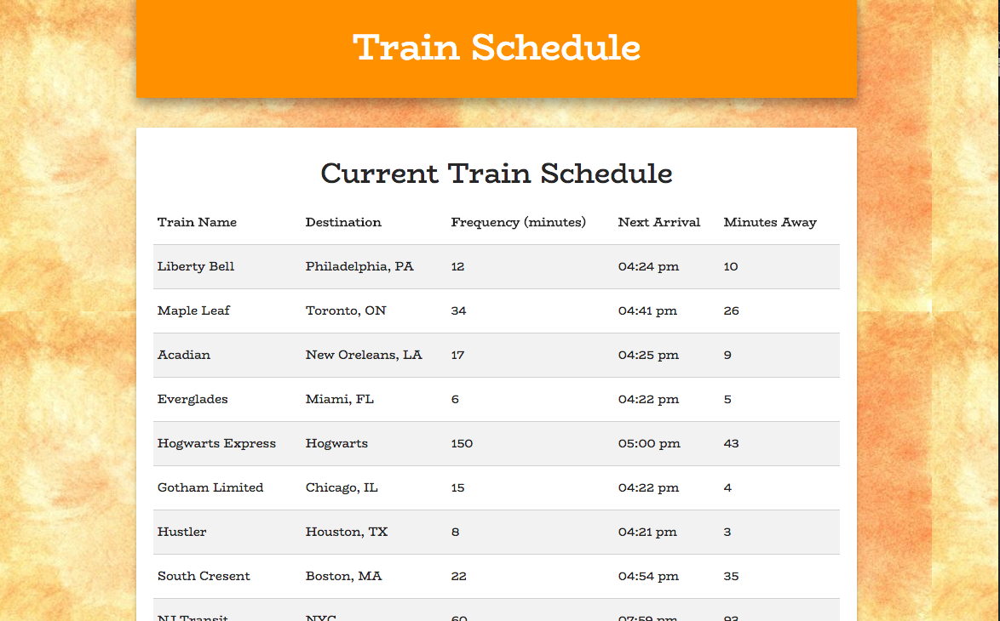
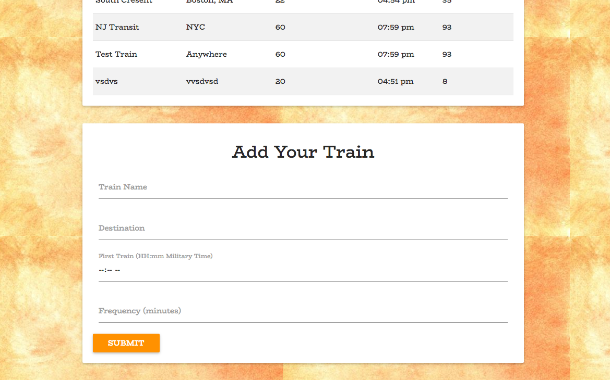

# TrainTime-Firebase

Firebase Application to accept input from user to create a fictional train list and calculate the next train and minutes away.

## Getting Started

http://fast-waters-56711.herokuapp.com/

## Screen Shot


List of trains saved to the Firebase Database.


Form to create new trains to add to the database.

## Technologies used

- Google Fonts
- jQuery
- Firebase

### Prerequisites

```
- Materialize: visit http://materializecss.com/getting-started.html for the CDN and link in html
- jQuery: visit http://code.jquery.com/ and link in html
- Firebase: https://firebase.google.com/
```

## Built With

- Sublime Text - Text Editor
- Materialize - Wireframe

## Authors

- **Ralph Wright** - _HTML/CSS/JS_ -(https://github.com/ralphwright)
